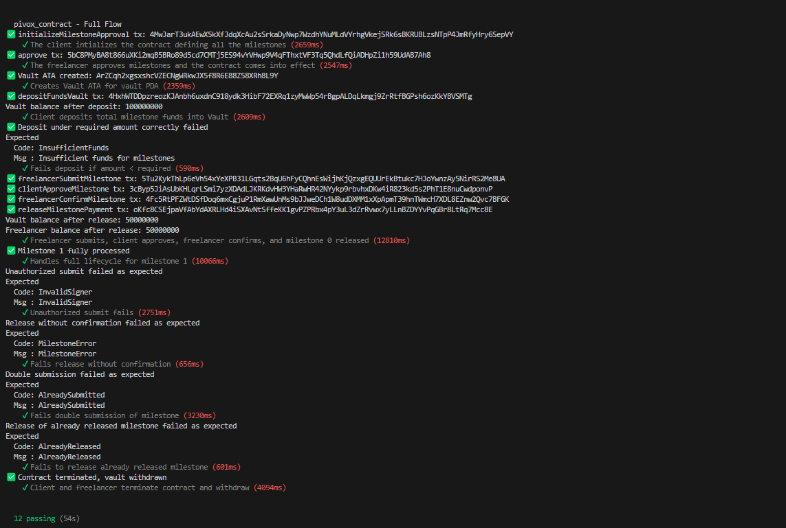

# PIVOX

PIVOX is a decentralized milestone-based payment protocol built on Solana using the Anchor framework.
It enables transparent, secure, and trustless payments between clients and freelancers, leveraging milestone tracking, escrowed funds management, and multi-signature logic.
Additionally, the protocol supports optional Project Manager (PM) read-only access for enhanced project oversight without mutability rights.

### Program-ID : 3zQWBv2YdLqZofanKcE4C7JEgM8PaL4Lemu6dZSqiNCv
### Explorer Link: https://explorer.solana.com/address/3zQWBv2YdLqZofanKcE4C7JEgM8PaL4Lemu6dZSqiNCv?cluster=devnet
### Wallet : E5dfX3skKzjkUiFoJMwkw5msNhFWmWQzA1BKBZQohKsK

## ✨ Key Features

- **Milestone-Based Payment Flows**
  - Funds are escrowed upfront and progressively released as milestones are completed and approved by all parties.
- **Multi-Signature Governance**
  - Milestone actions require approvals from both client and freelancer, ensuring mutual agreement and transparency.
- **Optional Project Manager Viewing Rights**
  - PM can access all contract and milestone data in read-only mode (optional).
- **Secure SPL Token Vaults**
  - Uses SPL Token vault accounts to manage funds securely on-chain.

## 📋 Main Instructions Overview

| Instruction                  | Description                                                   |
|------------------------------|---------------------------------------------------------------|
| initializeMilestoneApproval   | Initialize the milestone approval account with threshold     |
| approve                       | Freelancer approves and initializes the contract and milestones |
| freelancerSubmitMilestone     | Freelancer submits a completed milestone                     |
| clientApproveMilestone        | Client approves the submitted milestone                      |
| freelancerConfirmMilestone    | Freelancer confirms the client approval                      |
| releaseMilestonePayment       | Client releases the payment for an approved milestone        |
| completeOrCancelContract      | Client and freelancer jointly terminate and close the contract |

## 🛠️ Setup & Deployment

### Install Dependencies

```bash
yarn install
```

### Build the Program

```bash
anchor build
```

### Deploy to Devnet (Helius RPC supported)

```bash
anchor deploy --provider.cluster https://api.devnet.solana.com
```

### Run Tests (on Devnet or Helius Devnet)

```bash
anchor test --provider.cluster https://api.devnet.solana.com
```

### Devent Test Result

